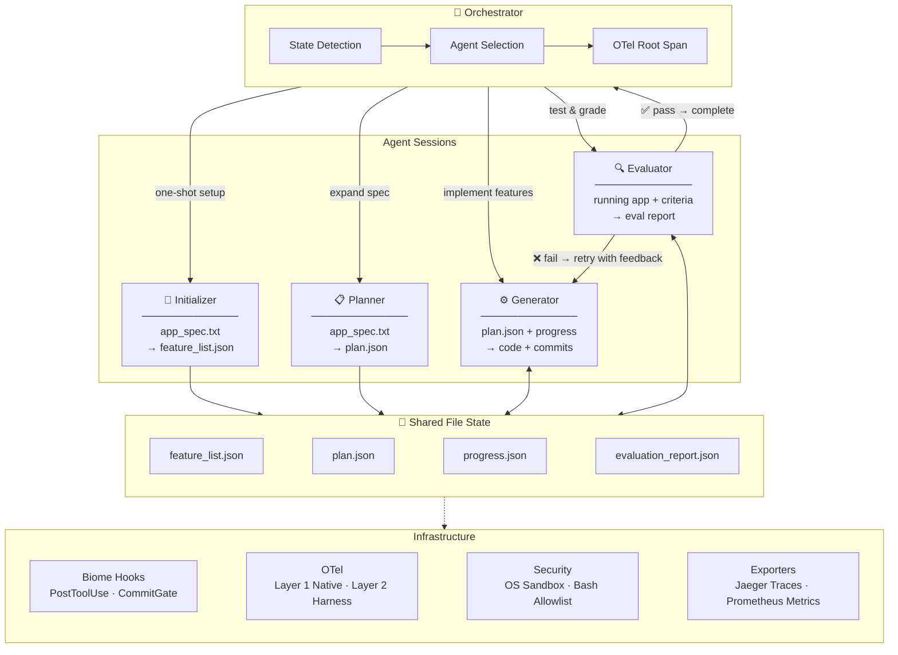

# Enterprise Agent Development Lifecycle

A production-grade reference architecture for building long-running, multi-agent systems using the Claude Agent SDK. The **Agent Development Lifecycle (ADLC)** defines a structured, observable, and quality-gated process for autonomous code generation — from specification to evaluation.

## What is the ADLC?

The ADLC is a GAN-inspired three-agent orchestration pattern where:

1. **Planner** — expands a brief app spec into a full product plan with prioritized features
2. **Generator** — implements features one at a time with real-world testing and quality gates
3. **Evaluator** — independently tests the output as a skeptical end-user, grading across design, originality, craft, and functionality

Each agent communicates through **file-based state** (JSON validated by Zod schemas), enabling multi-session work that survives context resets. The orchestrator manages handoffs, owns the observability root span, and enforces security boundaries.

## Architecture



## Tech Stack

| Component | Technology |
|-----------|-----------|
| Runtime | [Bun](https://bun.sh) |
| Language | TypeScript |
| Agent SDK | `@anthropic-ai/claude-agent-sdk` |
| Schemas | Zod |
| Code Quality | Biome (format + lint) |
| Observability | OpenTelemetry + Jaeger (traces) + Prometheus (metrics) |
| CLI | Commander |
| Browser Testing | agent-browser CLI |

## Project Structure

```
src/
  agents/       # Agent implementations (initializer, planner, generator, evaluator)
  schemas/      # Zod schema library (features, progress, plans, evaluations)
  hooks/        # Biome & OTel hook implementations
  otel/         # OpenTelemetry instrumentation
  mcp/          # MCP server utilities
prompts/        # Agent prompt templates (loaded at runtime)
projects/
  hello-world/       # Phase 1: Stack validation project
  tdx-mcp-server/    # Phase 2: Production MCP server
docs/           # Reference architecture documentation
```

## Quick Start

### Prerequisites

- [Bun](https://bun.sh) (latest)
- [Docker](https://docker.com) (for Jaeger + Prometheus observability stack)
- [gh CLI](https://cli.github.com) (for issue tracking)
- Anthropic API key (`ANTHROPIC_API_KEY`)

### Install

```bash
bun install
```

### Run

```bash
# Basic usage — point at a project directory containing app_spec.txt
bun run index.ts -p ./projects/my-app

# Full options
bun run index.ts \
  -p ./projects/my-app \
  -m claude-sonnet-4-6 \
  --planner-model claude-opus-4-6 \
  --evaluator-model claude-opus-4-6 \
  --max-iterations 10 \
  --max-evaluator-retries 3 \
  --pass-threshold 6 \
  --otel-endpoint http://localhost:4318

# Disable optional features
bun run index.ts -p ./projects/my-app --no-evaluator --no-biome --no-otel
```

| Flag | Default | Description |
|------|---------|-------------|
| `-p, --project-dir` | *(required)* | Path to the project directory |
| `-m, --model` | `claude-sonnet-4-6` | Generator model |
| `--planner-model` | `claude-opus-4-6` | Planner model |
| `--evaluator-model` | `claude-opus-4-6` | Evaluator model |
| `-i, --max-iterations` | `0` (unlimited) | Maximum orchestrator iterations |
| `--max-evaluator-retries` | `3` | Max evaluator retry attempts before stopping |
| `--pass-threshold` | `6` | Evaluator pass/fail score threshold (0-10) |
| `--otel-endpoint` | `http://localhost:4318` | OTLP HTTP collector endpoint |
| `--no-evaluator` | — | Disable the evaluator agent |
| `--no-biome` | — | Disable Biome lint hooks |
| `--no-otel` | — | Disable OpenTelemetry instrumentation |

## Documentation

The `docs/` directory contains the complete ADLC reference:

- **[Reference Architecture](docs/claude-agent-sdk-reference-architecture.md)** — Core architecture, orchestrator, hooks, OTel, security model
- **[Hello World Guide](docs/hello-world-guide.md)** — Phase 1 validation project walkthrough
- **[Prompt Templates](docs/prompt-templates.md)** — All agent prompt templates
- **[SDK API Reference](docs/sdk-api-reference.md)** — Complete TypeScript SDK API
- **[Source Analysis](docs/source-analysis.md)** — Research synthesis justifying architecture decisions
- **[TDX MCP Server Design](docs/tdx-mcp-server-design.md)** — Phase 2 production use case
- **[Zod Schema Library](docs/zod-schema-library.md)** — All inter-agent data contracts

## Key Design Principles

- **One feature per session** — prevents over-ambition and context exhaustion
- **File-based state** — survives context resets, no shared memory required
- **Zod at every boundary** — all structured state validated at read/write
- **Biome as hard gate** — commits blocked on lint errors; quality is non-negotiable
- **Separated evaluator** — overcomes self-evaluation bias with tuned skepticism
- **Two-layer observability** — native OTel (per-session) + harness-level (cross-session)
- **Simplicity-first** — remove complexity as models improve

## License

MIT
