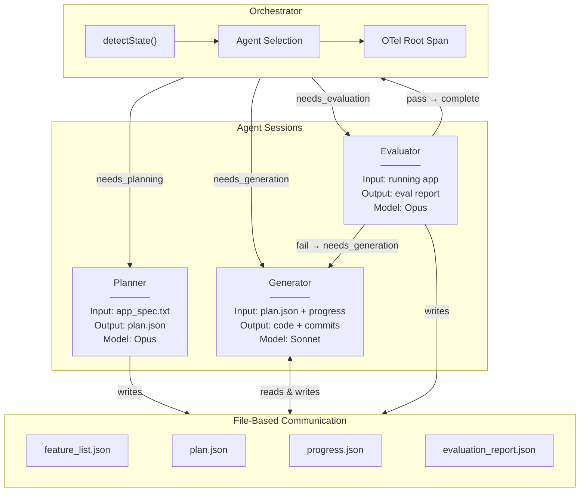
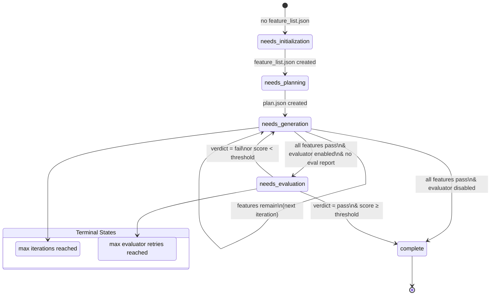
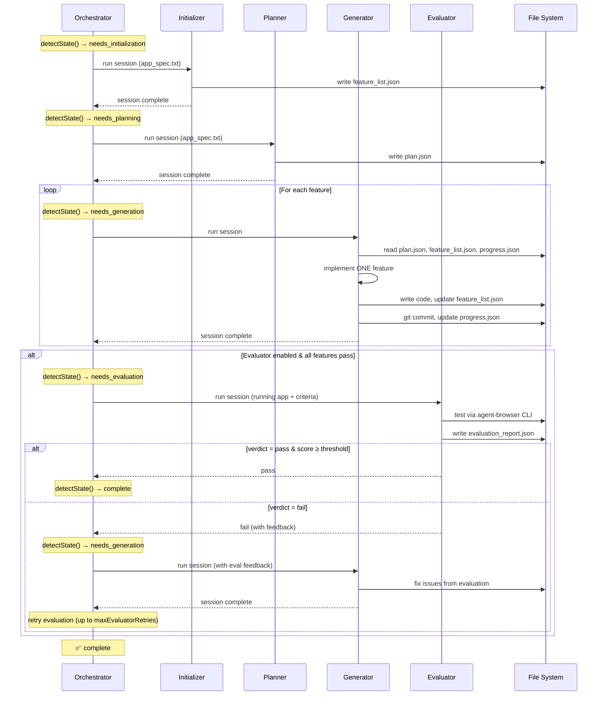
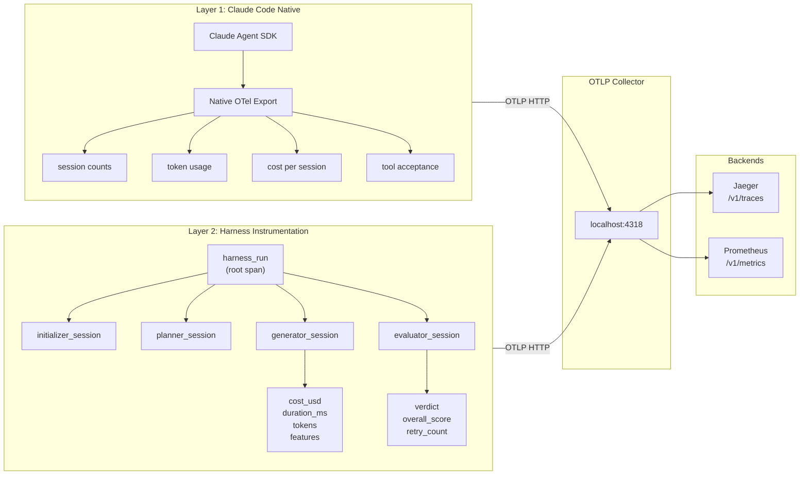
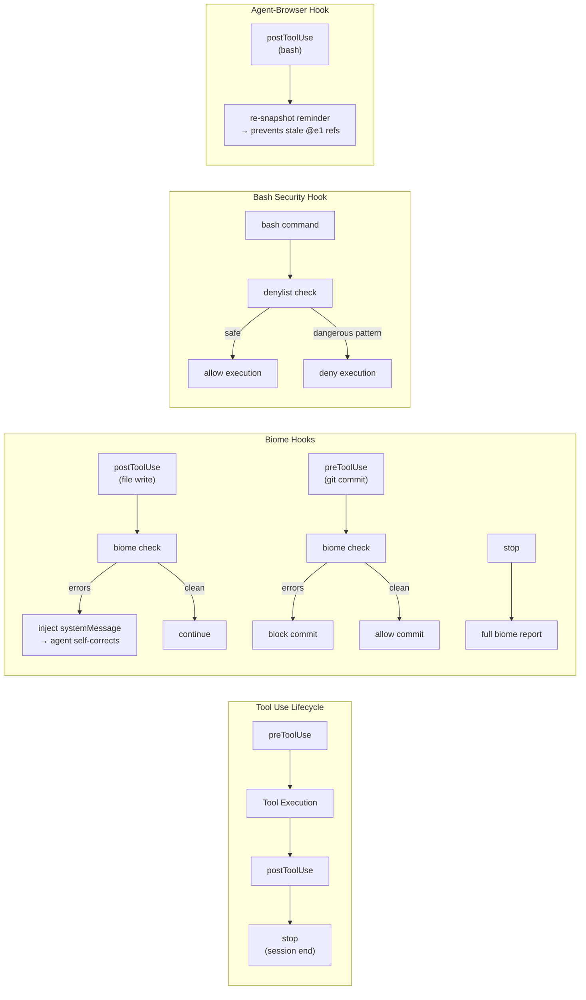

# Claude Agent SDK Reference Architecture

**University of Idaho OIT — Enterprise Applications Development**
**Stack: TypeScript · Bun · Biome · Zod · OpenTelemetry**
**Date: March 29, 2026**

---

## Table of Contents

1. [Executive Summary](#1-executive-summary)
2. [Architecture Translation: Python → TypeScript/Bun/Biome/Zod](#2-architecture-translation)
3. [Three-Agent System Design](#3-three-agent-system-design)
4. [OpenTelemetry Observability Layer](#4-opentelemetry-observability-layer)
5. [Biome Static Analysis Integration](#5-biome-static-analysis-integration)
6. [Open Questions](#6-open-questions)

### Companion Documents

| Document | Contents |
|---|---|
| [Source Analysis](./source-analysis.md) | Research synthesis of five Anthropic resources informing this architecture |
| [SDK API Reference](./sdk-api-reference.md) | TypeScript API reference for `@anthropic-ai/claude-agent-sdk` |
| [Zod Schema Library](./zod-schema-library.md) | Complete Zod schema definitions for all inter-agent structured state |
| [Hello World Guide](./hello-world-guide.md) | Step-by-step walkthrough validating the full stack end-to-end |
| [TDX MCP Server Design](./tdx-mcp-server-design.md) | Design document for the TeamDynamix MCP server (first production project) |
| [Prompt Templates](./prompt-templates.md) | Agent prompt templates for the three-agent system |

---

## 1. Executive Summary

This document defines a reusable reference architecture for building long-running, multi-agent harnesses using the Claude Agent SDK with TypeScript, Bun, Biome, and Zod. It synthesizes patterns from Anthropic's published research on autonomous coding agents, translates the Python reference implementation to our stack, and extends it with production-grade observability and static analysis integration.

### What This Architecture Is

A three-agent orchestration system — Planner, Generator, and Evaluator — that transforms short natural-language prompts into working software through iterative, self-correcting development cycles. The architecture solves the "context window gap" problem: long-running tasks that exceed a single context window require structured handoff mechanisms so each new agent session can resume work without information loss.

### Why It Exists

Anthropic's research documents two persistent failure modes when agents attempt long-running tasks:

1. **Over-ambition**: The agent tries to implement everything at once, exhausts its context mid-feature, and leaves undocumented, half-finished work that consumes the next session's tokens for recovery.
2. **Premature completion**: Later agent sessions survey completed work and incorrectly declare the project finished despite incomplete requirements.

The architecture encodes countermeasures for both: a structured feature list (JSON, not Markdown) as the single source of truth, file-based inter-agent communication, git-based state persistence, and a separated evaluator agent that prevents the generator from grading its own work.

> **Deep dive**: See [Source Analysis](./source-analysis.md) for the full research synthesis behind these decisions.

### Key Decisions

- **Bun over Node.js**: Native TypeScript execution, built-in test runner, `Bun.file()` / `Bun.spawn()` / `Bun.serve()` APIs, and faster startup times.
- **Zod for every boundary**: Every piece of structured state flowing between agents — feature lists, progress entries, sprint contracts, evaluation reports — is validated with Zod schemas at read and write boundaries. See [Zod Schema Library](./zod-schema-library.md) for the complete schema catalog.
- **Biome for code quality gates**: Integrated into the agent loop via SDK hooks. The agent gets immediate feedback on lint errors after every file write, cannot commit code with Biome errors, and produces a full-project quality report at session end.
- **OpenTelemetry for full-lifecycle observability**: Two-layer telemetry — Claude Code's native OTel export for per-session metrics, plus harness-level instrumentation that connects the dots across multi-agent sessions with hierarchical traces.
- **Simplicity first**: Every harness component encodes an assumption about what the model can't do on its own. Those assumptions are worth stress-testing, and the architecture should get simpler over time as models improve.

### First Two Projects

1. **Hello World**: A single-file Bun HTTP server that validates the full stack end-to-end — SDK integration, agent handoff, feature tracking, OTel instrumentation, and Biome hook feedback. See [Hello World Guide](./hello-world-guide.md).
2. **TeamDynamix MCP Server**: An MCP server exposing TDX REST API operations as tools — the first real production use case for this architecture at UI OIT. See [TDX MCP Server Design](./tdx-mcp-server-design.md).

---

## 2. Architecture Translation: Python → TypeScript/Bun/Biome/Zod

### 2.1 Stack Mapping

| Python Quickstart | Our Stack | Rationale |
|---|---|---|
| Python 3.10+ | Bun (latest) | Native TS, faster startup, built-in test runner |
| `claude-code-sdk` (pip) | `@anthropic-ai/claude-agent-sdk` (bun add) | Official TypeScript SDK |
| `argparse` | `commander` or Bun `process.argv` | CLI argument parsing |
| Untyped dicts/JSON | Zod schemas for all structured state | Runtime type validation at every boundary |
| No linting | Biome for formatting + linting + import sorting | Rust-native speed, single tool |
| `requirements.txt` | `package.json` + `bun.lock` | Bun's package manager |
| No observability | `@opentelemetry/api` + SDK exporters | Full traces, metrics, structured logs |
| `json.loads()` / `json.dumps()` | Zod `.parse()` / `JSON.stringify()` | Schema validation on every read |
| `os.path` / `pathlib` | `node:path` + `Bun.file()` | Bun-native file I/O |
| `subprocess` | `Bun.spawn()` | Bun-native process spawning |
| `asyncio` | Native `async/await` + `for await` | First-class async in TS |

### 2.2 File-by-File Translation

#### `autonomous_agent_demo.py` → `src/cli.ts`

**What it does**: Entry point. Parses CLI args, loads optional config file, validates configuration, orchestrates the session loop.

**TypeScript equivalent**:

```typescript
// src/cli.ts
import { resolve } from "node:path";
import { Command } from "commander";
import { loadConfigFile, mergeConfigs, formatValidationErrors } from "./config-loader.js";
import { runOrchestrator, runSingleAgent } from "./orchestrator.js";
import { AgentConfigSchema } from "./schemas/config.js";

const program = new Command()
  .name("adlc")
  .description("Agent Development Lifecycle — orchestrate multi-agent autonomous coding")
  .option("-d, --project-dir <path>", "Path to the project directory", process.cwd())
  .option("-a, --agent <type>", "Run a single agent instead of the full orchestrator loop")
  .option("-m, --model <model>", "Generator model", "claude-sonnet-4-6")
  .option("--planner-model <model>", "Planner model", "claude-opus-4-6")
  .option("--evaluator-model <model>", "Evaluator model", "claude-opus-4-6")
  .option("--max-iterations <n>", "Maximum orchestrator iterations (0 = unlimited)", "0")
  .option("--no-evaluator", "Disable the evaluator agent")
  .option("--no-biome", "Disable Biome lint hooks")
  .option("--no-otel", "Disable OpenTelemetry instrumentation")
  .option("--otel-endpoint <url>", "OTel collector endpoint", "http://localhost:4318")
  .option("--max-evaluator-retries <n>", "Max evaluator retry attempts", "3")
  .option("--pass-threshold <n>", "Evaluator pass/fail threshold (0-10)", "6");

program.parse();
// ... buildConfig merges CLI args > agent-config.json > schema defaults
// ... dispatches to runOrchestrator or runSingleAgent
```

**Key features**: Commander-based CLI with `--agent` override for single-agent runs, optional `agent-config.json` config file support, and user-friendly Zod validation error messages.

#### `agent.py` → `src/agent.ts`

**What it does**: Core session logic. Detects initialization state, selects prompt, runs agent session, handles streaming responses.

**TypeScript equivalent**:

```typescript
// src/agent.ts
import { query, type SDKMessage } from "@anthropic-ai/claude-agent-sdk";
import { createClient } from "./client";
import { featureListExists, countPassingTests, printProgress } from "./progress";
import { getInitializerPrompt, getCodingPrompt } from "./prompts";
import type { AgentConfig } from "./schemas";

async function runAgentSession(
  config: AgentConfig,
  prompt: string,
  sessionType: "initializer" | "coding"
): Promise<void> {
  const clientOptions = createClient(config);

  for await (const message of query({
    prompt,
    options: {
      ...clientOptions,
      model: config.model,
      cwd: config.projectDir,
    },
  })) {
    handleMessage(message, sessionType);
  }
}

function handleMessage(message: SDKMessage, sessionType: string): void {
  switch (message.type) {
    case "assistant":
      for (const block of message.message.content) {
        if (block.type === "text") process.stdout.write(block.text);
        if (block.type === "tool_use") console.log(`\n[Tool: ${block.name}]`);
      }
      break;
    case "result":
      console.log(`\nSession complete: ${message.subtype}`);
      if (message.total_cost_usd) {
        console.log(`Cost: $${message.total_cost_usd.toFixed(4)}`);
      }
      break;
  }
}

export async function runAutonomousAgent(config: AgentConfig): Promise<void> {
  let iteration = 0;

  while (config.maxIterations === 0 || iteration < config.maxIterations) {
    iteration++;
    const isInitialized = await featureListExists(config.projectDir);

    const prompt = isInitialized
      ? getCodingPrompt(config.projectDir)
      : getInitializerPrompt(config.projectDir);

    const sessionType = isInitialized ? "coding" : "initializer";

    console.log(`\n${"=".repeat(60)}`);
    console.log(`Session ${iteration} (${sessionType})`);
    console.log(`${"=".repeat(60)}\n`);

    if (isInitialized) {
      const { passing, total } = await countPassingTests(config.projectDir);
      printProgress(passing, total);
      if (passing === total && total > 0) {
        console.log("\nAll features passing! Project complete.");
        break;
      }
    }

    await runAgentSession(config, prompt, sessionType);

    // 3-second delay before next session
    await Bun.sleep(3000);
  }
}
```

#### `client.py` → `src/client.ts`

**What it does**: Configures the SDK client with security hooks, filesystem restrictions, and MCP servers.

```typescript
// src/client.ts
import type { Options } from "@anthropic-ai/claude-agent-sdk";
import { bashSecurityHook } from "./security";
import type { AgentConfig } from "./schemas";

export function createClient(config: AgentConfig): Partial<Options> {
  return {
    permissionMode: "bypassPermissions",
    // Browser automation via agent-browser CLI through Bash tool
    allowedTools: [
      "Read", "Write", "Edit", "Glob", "Grep", "Bash",
    ],
    hooks: {
      PreToolUse: [
        {
          matcher: "Bash",
          hooks: [bashSecurityHook],
        },
      ],
    },
    settingSources: ["project"],
  };
}
```

#### `security.py` → `src/security.ts`

**What it does**: Validates bash commands against an allowlist.

```typescript
// src/security.ts
import type { HookOutput } from "@anthropic-ai/claude-agent-sdk";

const ALLOWED_COMMANDS = new Set([
  "ls", "cat", "head", "tail", "wc", "grep",
  "cp", "mkdir", "chmod",
  "npm", "node", "npx", "bun", "bunx",
  "git",
  "ps", "lsof", "sleep", "pkill",
  "init.sh", "./init.sh", "bash",
  "biome",
  "agent-browser",  // Browser automation CLI for evaluator/generator testing
]);

function extractCommands(commandStr: string): string[] {
  // Split on pipes and chain operators
  const parts = commandStr.split(/\s*(?:\||&&|\|\||;)\s*/);
  return parts.map((part) => {
    const tokens = part.trim().split(/\s+/);
    return tokens[0] ?? "";
  }).filter(Boolean);
}

export async function bashSecurityHook(
  input: { tool_input: Record<string, unknown> },
): Promise<HookOutput> {
  const command = input.tool_input.command as string;
  if (!command) {
    return {
      hookSpecificOutput: {
        hookEventName: "PreToolUse",
        permissionDecision: "deny",
        permissionDecisionReason: "Empty command",
      },
    };
  }

  const commands = extractCommands(command);

  for (const cmd of commands) {
    const baseCmd = cmd.split("/").pop() ?? cmd;
    if (!ALLOWED_COMMANDS.has(baseCmd)) {
      return {
        hookSpecificOutput: {
          hookEventName: "PreToolUse",
          permissionDecision: "deny",
          permissionDecisionReason: `Command not allowed: ${baseCmd}`,
        },
      };
    }
  }

  // Validate pkill targets
  if (command.includes("pkill")) {
    const allowedTargets = ["node", "npm", "bun", "vite", "next"];
    const hasAllowedTarget = allowedTargets.some((t) => command.includes(t));
    if (!hasAllowedTarget) {
      return {
        hookSpecificOutput: {
          hookEventName: "PreToolUse",
          permissionDecision: "deny",
          permissionDecisionReason: "pkill only allowed for dev processes",
        },
      };
    }
  }

  return {
    hookSpecificOutput: {
      hookEventName: "PreToolUse",
      permissionDecision: "allow",
    },
  };
}
```

#### `progress.py` → `src/state.ts`

File-based state management with Zod validation at every read/write boundary and atomic writes (temp file + rename) to prevent corruption on crash. Each state file has a typed read function (returns `null` if missing) and a typed write function.

```typescript
// src/state.ts
import { rename, unlink } from "node:fs/promises";
import { resolve } from "node:path";
import type { z } from "zod";
import {
  type FeatureList, FeatureListSchema,
  type ProgressLog, ProgressLogSchema,
  type Plan, PlanSchema,
  type EvaluatorReport, EvaluatorReportSchema,
  type SprintContract, SprintContractSchema,
} from "./schemas/index.js";

async function readStateFile<T>(
  projectDir: string, filename: string, schema: z.ZodType<T>,
): Promise<T | null> {
  const file = Bun.file(resolve(projectDir, filename));
  if (!(await file.exists())) return null;
  return schema.parse(await file.json());
}

async function writeStateFile<T>(
  projectDir: string, filename: string, schema: z.ZodType<T>, data: T,
): Promise<void> {
  const validated = schema.parse(data);
  const targetPath = resolve(projectDir, filename);
  const tmpPath = `${targetPath}.tmp.${Date.now()}`;
  try {
    await Bun.write(tmpPath, JSON.stringify(validated, null, 2));
    await rename(tmpPath, targetPath);
  } catch (err) {
    try { await unlink(tmpPath); } catch {}
    throw err;
  }
}

// Public API — one read/write pair per state file:
// readFeatureList / writeFeatureList       → feature_list.json
// readProgress / writeProgress             → progress.json
// readPlan / writePlan                     → plan.json
// readEvaluationReport / writeEvaluationReport → evaluation_report.json
// readSprintContract / writeSprintContract → sprint_contract.json
```

#### `prompts.py` → `src/prompts.ts`

```typescript
// src/prompts.ts
import { resolve } from "node:path";

const PROMPTS_DIR = resolve(import.meta.dir, "../prompts");

export function loadPrompt(filename: string): string {
  return Bun.file(resolve(PROMPTS_DIR, filename)).text() as unknown as string;
}

export function getInitializerPrompt(projectDir: string): string {
  const prompt = loadPrompt("initializer_prompt.md");
  return prompt.replace("{{PROJECT_DIR}}", projectDir);
}

export function getCodingPrompt(projectDir: string): string {
  const prompt = loadPrompt("coding_prompt.md");
  return prompt.replace("{{PROJECT_DIR}}", projectDir);
}

export async function copySpecToProject(projectDir: string): Promise<void> {
  const spec = await Bun.file(resolve(PROMPTS_DIR, "app_spec.txt")).text();
  await Bun.write(resolve(projectDir, "app_spec.txt"), spec);
}
```

### 2.3 Project Structure

```
agent-harness/
├── biome.json                     # Biome configuration
├── bun.lock                       # Lock file
├── package.json                   # Dependencies and scripts
├── tsconfig.json                  # TypeScript configuration
├── src/
│   ├── main.ts                    # Entry point (← autonomous_agent_demo.py)
│   ├── agent.ts                   # Session logic (← agent.py)
│   ├── client.ts                  # SDK configuration (← client.py)
│   ├── security.ts                # Bash allowlist (← security.py)
│   ├── state.ts                   # File-based state management (← progress.py)
│   ├── prompts.ts                 # Prompt loading (← prompts.py)
│   ├── schemas.ts                 # All Zod schemas (NEW)
│   ├── observability.ts           # OTel instrumentation (NEW)
│   ├── biome-hooks.ts             # Biome integration hooks (NEW)
│   ├── agent-browser-hooks.ts     # Stale-ref reminder hook for agent-browser (NEW)
│   └── orchestrator.ts            # Three-agent orchestrator (NEW)
├── prompts/
│   ├── app_spec.txt               # Application specification
│   ├── initializer_prompt.md      # First session prompt
│   ├── coding_prompt.md           # Continuation session prompt
│   ├── planner_prompt.md          # Planner agent prompt (NEW)
│   ├── generator_prompt.md        # Generator agent prompt (NEW)
│   └── evaluator_prompt.md        # Evaluator agent prompt (NEW)
├── tests/
│   ├── security.test.ts           # Security validation tests
│   ├── schemas.test.ts            # Schema validation tests
│   └── biome-hooks.test.ts        # Biome hook tests
└── generations/                   # Generated project outputs
    └── [project-name]/
        ├── feature_list.json
        ├── plan.json
        ├── progress.json
        ├── evaluation_report.json
        ├── init.sh
        └── [application files]
```

### 2.4 `package.json`

```json
{
  "name": "agent-harness",
  "version": "0.1.0",
  "type": "module",
  "scripts": {
    "start": "bun run src/cli.ts",
    "dev": "bun --watch run src/cli.ts",
    "test": "bun test",
    "check": "biome check .",
    "format": "biome check --write ."
  },
  "dependencies": {
    "@anthropic-ai/claude-agent-sdk": "^0.2.87",
    "@opentelemetry/api": "^1.9.0",
    "@opentelemetry/api-logs": "^0.52.0",
    "@opentelemetry/sdk-node": "^0.52.0",
    "@opentelemetry/sdk-trace-base": "^1.25.0",
    "@opentelemetry/sdk-metrics": "^1.25.0",
    "@opentelemetry/sdk-logs": "^0.52.0",
    "@opentelemetry/exporter-trace-otlp-grpc": "^0.52.0",
    "@opentelemetry/exporter-metrics-otlp-grpc": "^0.52.0",
    "@opentelemetry/exporter-logs-otlp-grpc": "^0.52.0",
    "@opentelemetry/resources": "^1.25.0",
    "@opentelemetry/semantic-conventions": "^1.25.0",
    "zod": "^3.23.0",
    "commander": "^12.1.0"
  },
  "devDependencies": {
    "@biomejs/biome": "^1.9.0",
    "@types/bun": "latest"
  }
}
```

### 2.5 `tsconfig.json`

```json
{
  "compilerOptions": {
    "target": "ESNext",
    "module": "ESNext",
    "moduleResolution": "bundler",
    "strict": true,
    "noUncheckedIndexedAccess": true,
    "esModuleInterop": true,
    "skipLibCheck": true,
    "outDir": "./dist",
    "rootDir": "./src",
    "types": ["bun-types"]
  },
  "include": ["src/**/*.ts"],
  "exclude": ["node_modules", "dist", "generations"]
}
```

---

## 3. Three-Agent System Design

### 3.1 Architecture Overview

#### System Flow



#### Orchestrator State Machine



#### Agent Interaction Sequence



> **Schema definitions**: See [Zod Schema Library](./zod-schema-library.md) for all structured state schemas.
> **Prompt templates**: See [Prompt Templates](./prompt-templates.md) for agent system prompts.

### 3.2 Orchestrator (`src/orchestrator.ts`)

The orchestrator is the harness itself. It owns the root OTel span, detects project state, and decides which agent to run next.

```typescript
// src/orchestrator.ts
import { query, type SDKMessage, type ResultMessage } from "@anthropic-ai/claude-agent-sdk";
import { resolve } from "node:path";
import { PlanSchema, EvaluatorReportSchema, type AgentConfig } from "./schemas";
import { featureListExists, countPassingTests } from "./progress";
import { createOtelContext, recordSessionMetrics } from "./observability";
import { createBiomeHooks } from "./biome-hooks";
import { createAgentBrowserHooks } from "./agent-browser-hooks";

type OrchestratorState =
  | "needs_planning"       // No plan.json exists
  | "needs_generation"     // Plan exists, features remain
  | "needs_evaluation"     // Generator finished, evaluator enabled
  | "complete";            // All features passing

async function detectState(config: AgentConfig): Promise<OrchestratorState> {
  const planExists = await Bun.file(resolve(config.projectDir, "plan.json")).exists();
  if (!planExists) return "needs_planning";

  const { passing, total } = await countPassingTests(config.projectDir);
  if (passing === total && total > 0) return "complete";

  // Check if there's a pending evaluation report requesting retry
  const evalReportPath = resolve(config.projectDir, "evaluation_report.json");
  const evalExists = await Bun.file(evalReportPath).exists();
  if (evalExists) {
    const raw = await Bun.file(evalReportPath).json();
    const report = EvaluatorReportSchema.parse(raw);
    if (report.verdict === "fail") return "needs_generation"; // Retry with feedback
  }

  return "needs_generation";
}

export async function runOrchestrator(config: AgentConfig): Promise<void> {
  const otel = createOtelContext(config);
  const rootSpan = otel.startSpan("harness_run");

  let iteration = 0;
  let evaluatorRetries = 0;

  try {
    while (config.maxIterations === 0 || iteration < config.maxIterations) {
      const state = await detectState(config);
      if (state === "complete") {
        console.log("All features passing. Project complete.");
        break;
      }

      iteration++;

      switch (state) {
        case "needs_planning":
          await runPlannerSession(config, otel, rootSpan);
          break;

        case "needs_generation":
          await runGeneratorSession(config, otel, rootSpan, iteration);
          if (config.enableEvaluator) {
            const passed = await runEvaluatorSession(config, otel, rootSpan);
            if (!passed && evaluatorRetries < config.maxEvaluatorRetries) {
              evaluatorRetries++;
              // Generator will see evaluation_report.json on next loop
            } else {
              evaluatorRetries = 0;
            }
          }
          break;
      }

      await Bun.sleep(3000);
    }
  } finally {
    rootSpan.end();
    await otel.shutdown();
  }
}
```

### 3.3 Planner Agent

**Input**: Short natural-language prompt (1-4 sentences).
**Output**: `plan.json` — full product spec as Zod-validated JSON.

```typescript
async function runPlannerSession(
  config: AgentConfig,
  otel: OtelContext,
  parentSpan: Span
): Promise<void> {
  const span = otel.startSpan("planner_session", { parent: parentSpan });

  const prompt = await Bun.file(resolve(import.meta.dir, "../prompts/planner_prompt.md")).text();
  const appSpec = await Bun.file(resolve(config.projectDir, "app_spec.txt")).text();

  for await (const message of query({
    prompt: prompt.replace("{{APP_SPEC}}", appSpec),
    options: {
      model: config.plannerModel,
      cwd: config.projectDir,
      permissionMode: "bypassPermissions",
      allowedTools: ["Read", "Write", "Bash"],
      systemPrompt: "You are a product architect. Output plan.json with Zod-validated structure.",
    },
  })) {
    handleMessage(message);
    if (message.type === "result") {
      recordSessionMetrics(otel, span, message, "planner");
    }
  }

  // Validate the plan was written correctly
  const planRaw = await Bun.file(resolve(config.projectDir, "plan.json")).json();
  PlanSchema.parse(planRaw); // Throws if invalid

  span.end();
}
```

**Prompt engineering principles** (from [Source Analysis](./source-analysis.md)):
- Be ambitious about scope
- Focus on product context and high-level technical design, not granular implementation details
- Weave AI features into specs where appropriate
- Avoid over-specification to prevent downstream cascading errors

### 3.4 Generator Agent

**Input**: Reads `plan.json`, git history, `progress.json`, and any `evaluation_report.json` with feedback.
**Boot sequence**: `pwd` → read progress → read plan → choose feature → run dev server → smoke test → implement → commit → update progress.

```typescript
async function runGeneratorSession(
  config: AgentConfig,
  otel: OtelContext,
  parentSpan: Span,
  iteration: number
): Promise<void> {
  const span = otel.startSpan("generator_session", {
    parent: parentSpan,
    attributes: { iteration },
  });

  const prompt = await Bun.file(resolve(import.meta.dir, "../prompts/generator_prompt.md")).text();
  const biomeHooks = config.enableBiomeHooks ? createBiomeHooks(config, otel) : {};
  const agentBrowserHooks = createAgentBrowserHooks();

  for await (const message of query({
    prompt,
    options: {
      model: config.model,
      cwd: config.projectDir,
      permissionMode: "bypassPermissions",
      // Browser automation via agent-browser CLI through Bash tool
      allowedTools: [
        "Read", "Write", "Edit", "Glob", "Grep", "Bash",
      ],
      hooks: {
        PreToolUse: [
          { matcher: "Bash", hooks: [bashSecurityHook] },
          ...(biomeHooks.preToolUse ?? []),
        ],
        PostToolUse: [
          ...(biomeHooks.postToolUse ?? []),
          ...(agentBrowserHooks.postToolUse ?? []),
        ],
        Stop: [
          ...(biomeHooks.stop ?? []),
        ],
        PreCompact: [
          ...(biomeHooks.preCompact ?? []),
        ],
      },
      env: {
        CLAUDE_CODE_ENABLE_TELEMETRY: "1",
        OTEL_METRICS_EXPORTER: "otlp",
        OTEL_LOGS_EXPORTER: "otlp",
        OTEL_EXPORTER_OTLP_ENDPOINT: config.otelEndpoint,
      },
    },
  })) {
    handleMessage(message);
    if (message.type === "result") {
      recordSessionMetrics(otel, span, message, "generator");
    }
  }

  span.end();
}
```

### 3.5 Evaluator Agent

**Input**: Running application, acceptance criteria from plan or sprint contract.
**Output**: `evaluation_report.json` — structured report with per-criterion scores and verdict.

```typescript
async function runEvaluatorSession(
  config: AgentConfig,
  otel: OtelContext,
  parentSpan: Span
): Promise<boolean> {
  const span = otel.startSpan("evaluator_session", { parent: parentSpan });

  const prompt = await Bun.file(resolve(import.meta.dir, "../prompts/evaluator_prompt.md")).text();
  const agentBrowserHooks = createAgentBrowserHooks();

  for await (const message of query({
    prompt,
    options: {
      model: config.evaluatorModel,
      cwd: config.projectDir,
      permissionMode: "bypassPermissions",
      // Browser automation via agent-browser CLI through Bash tool
      allowedTools: [
        "Read", "Write", "Bash",
      ],
      hooks: {
        PreToolUse: [
          { matcher: "Bash", hooks: [bashSecurityHook] },
        ],
        PostToolUse: [
          ...(agentBrowserHooks.postToolUse ?? []),
        ],
      },
    },
  })) {
    handleMessage(message);
    if (message.type === "result") {
      recordSessionMetrics(otel, span, message, "evaluator");
    }
  }

  // Read and validate the evaluation report
  const reportRaw = await Bun.file(
    resolve(config.projectDir, "evaluation_report.json")
  ).json();
  const report = EvaluatorReportSchema.parse(reportRaw);

  span.setAttribute("verdict", report.verdict);
  span.setAttribute("overall_score", report.overallScore);
  span.end();

  return report.verdict === "pass";
}
```

### 3.6 Design Decisions

**When to enable the evaluator**: "The evaluator is not a fixed yes-or-no decision. It is worth the cost when the task sits beyond what the current model does reliably solo." For simple projects (hello world, basic CRUD), skip the evaluator. For complex projects with UI requirements, enable it.

**File-based communication**: Agents communicate exclusively through files in the project directory: `plan.json`, `progress.json`, `evaluation_report.json`, `feature_list.json`, and git history. No shared memory, no message passing. This is intentional — it survives context resets.

**Graceful interruption**: `Ctrl+C` pauses the current session. Re-running the harness detects state via `detectState()` and resumes where it left off. Git commits ensure no work is lost.

**Model selection per role**:
- Planner: Opus 4.6 — needs strong reasoning for ambitious spec generation
- Generator: Sonnet 4.6 — good balance of speed, cost, and coding ability
- Evaluator: Opus 4.6 — needs strong judgment for skeptical evaluation

---

## 4. OpenTelemetry Observability Layer

### 4.1 Two Layers of Telemetry

**Layer 1: Claude Code's native OTel export**. Enabled via `CLAUDE_CODE_ENABLE_TELEMETRY=1`. Gives you per-session metrics: session counts, lines changed, token usage, cost, tool acceptance/rejection. Doesn't know about multi-agent architecture.

**Layer 2: Harness-level instrumentation**. What we build. Connects the dots across multi-agent sessions: planner → generator → evaluator → generator (retry) → evaluator (pass). Creates hierarchical traces, custom metrics, and structured logs.

**Complementary, not duplicative**: Layer 1 gives you per-session detail (token usage by type, tool acceptance rates by language). Layer 2 gives you cross-session orchestration visibility (total cost per feature, evaluator pass rate, retry patterns).

> **Layer 1 details**: See [Source Analysis — Resource 5](./source-analysis.md) for the full Claude Code native OTel specification.



### 4.2 OTel SDK Setup (`src/observability.ts`)

```typescript
// src/observability.ts
import { trace, metrics, context, SpanStatusCode, type Span } from "@opentelemetry/api";
import { logs } from "@opentelemetry/api-logs";
import { NodeSDK } from "@opentelemetry/sdk-node";
import { OTLPTraceExporter } from "@opentelemetry/exporter-trace-otlp-grpc";
import { OTLPMetricExporter } from "@opentelemetry/exporter-metrics-otlp-grpc";
import { OTLPLogExporter } from "@opentelemetry/exporter-logs-otlp-grpc";
import { Resource } from "@opentelemetry/resources";
import {
  ATTR_SERVICE_NAME,
  ATTR_SERVICE_VERSION,
  ATTR_DEPLOYMENT_ENVIRONMENT_NAME,
} from "@opentelemetry/semantic-conventions";
import { PeriodicExportingMetricReader } from "@opentelemetry/sdk-metrics";
import { BatchLogRecordProcessor } from "@opentelemetry/sdk-logs";
import type { AgentConfig, ResultMessage } from "./schemas";

const SERVICE_NAME = "agent-harness";
const SERVICE_VERSION = "0.1.0";

export interface OtelContext {
  tracer: ReturnType<typeof trace.getTracer>;
  meter: ReturnType<typeof metrics.getMeter>;
  logger: ReturnType<typeof logs.getLogger>;
  startSpan: (name: string, options?: { parent?: Span; attributes?: Record<string, string | number> }) => Span;
  shutdown: () => Promise<void>;
}

export function createOtelContext(config: AgentConfig): OtelContext {
  const resource = new Resource({
    [ATTR_SERVICE_NAME]: SERVICE_NAME,
    [ATTR_SERVICE_VERSION]: SERVICE_VERSION,
    [ATTR_DEPLOYMENT_ENVIRONMENT_NAME]: process.env.DEPLOYMENT_ENV ?? "development",
  });

  const sdk = new NodeSDK({
    resource,
    traceExporter: new OTLPTraceExporter({
      url: config.otelEndpoint,
    }),
    metricReader: new PeriodicExportingMetricReader({
      exporter: new OTLPMetricExporter({
        url: config.otelEndpoint,
      }),
      exportIntervalMillis: 10_000,
    }),
    logRecordProcessor: new BatchLogRecordProcessor(
      new OTLPLogExporter({
        url: config.otelEndpoint,
      })
    ),
  });

  sdk.start();

  const tracer = trace.getTracer(SERVICE_NAME, SERVICE_VERSION);
  const meter = metrics.getMeter(SERVICE_NAME, SERVICE_VERSION);
  const logger = logs.getLogger(SERVICE_NAME, SERVICE_VERSION);

  // --- Metrics ---
  const sessionCounter = meter.createCounter("harness.sessions.total", {
    description: "Total agent sessions",
  });
  const toolCallCounter = meter.createCounter("harness.tools.calls", {
    description: "Total tool calls",
  });
  const featuresCompletedCounter = meter.createCounter("harness.features.completed", {
    description: "Features completed",
  });
  const evaluatorVerdictCounter = meter.createCounter("harness.evaluator.verdicts", {
    description: "Evaluator verdicts",
  });
  const compactionCounter = meter.createCounter("harness.compactions", {
    description: "Context compactions",
  });

  const sessionDurationHistogram = meter.createHistogram("harness.session.duration_ms", {
    description: "Session duration",
    unit: "ms",
  });
  const sessionCostHistogram = meter.createHistogram("harness.session.cost_usd", {
    description: "Session cost",
    unit: "USD",
  });
  const sessionInputTokensHistogram = meter.createHistogram("harness.session.tokens.input", {
    description: "Input tokens per session",
  });
  const sessionOutputTokensHistogram = meter.createHistogram("harness.session.tokens.output", {
    description: "Output tokens per session",
  });
  const toolDurationHistogram = meter.createHistogram("harness.tool.duration_ms", {
    description: "Tool call duration",
    unit: "ms",
  });
  const featureDurationHistogram = meter.createHistogram("harness.feature.implementation_duration_ms", {
    description: "Feature implementation duration",
    unit: "ms",
  });

  const featuresRemainingGauge = meter.createObservableGauge("harness.features.remaining", {
    description: "Incomplete features",
  });
  const contextTokensGauge = meter.createObservableGauge("harness.context.tokens_before_compaction", {
    description: "Context pressure indicator",
  });

  return {
    tracer,
    meter,
    logger,
    startSpan(name, options) {
      if (options?.parent) {
        const ctx = trace.setSpan(context.active(), options.parent);
        return tracer.startSpan(name, { attributes: options.attributes }, ctx);
      }
      return tracer.startSpan(name, { attributes: options?.attributes });
    },
    async shutdown() {
      await sdk.shutdown();
    },
  };
}
```

### 4.3 Hook-to-OTel Mapping

```typescript
// src/observability-hooks.ts
import type { HookCallback, HookOutput } from "@anthropic-ai/claude-agent-sdk";
import type { OtelContext } from "./observability";
import { SpanStatusCode, type Span } from "@opentelemetry/api";
import { SeverityNumber } from "@opentelemetry/api-logs";

// Track active tool spans by tool_use_id
const activeToolSpans = new Map<string, { span: Span; startTime: number }>();

export function createObservabilityHooks(otel: OtelContext, sessionSpan: Span) {

  const sessionStartHook: HookCallback = async (input) => {
    otel.logger.emit({
      severityNumber: SeverityNumber.INFO,
      body: "Session started",
      attributes: {
        event: "session_start",
        session_id: input.session_id,
        agent_type: input.agent_type ?? "unknown",
        source: input.source ?? "unknown",
      },
    });
    return {};
  };

  const preToolUseHook: HookCallback = async (input, toolUseId) => {
    const span = otel.startSpan(`tool:${input.tool_name}`, {
      parent: sessionSpan,
      attributes: {
        "tool.name": input.tool_name,
        ...sanitizeToolInput(input.tool_name, input.tool_input),
      },
    });

    if (toolUseId) {
      activeToolSpans.set(toolUseId, { span, startTime: Date.now() });
    }

    return {};
  };

  const postToolUseHook: HookCallback = async (input, toolUseId) => {
    if (toolUseId && activeToolSpans.has(toolUseId)) {
      const { span, startTime } = activeToolSpans.get(toolUseId)!;
      const duration = Date.now() - startTime;

      span.setStatus({ code: SpanStatusCode.OK });
      span.setAttribute("tool.duration_ms", duration);
      span.end();

      activeToolSpans.delete(toolUseId);

      // Record tool duration metric
      otel.meter.createHistogram("harness.tool.duration_ms").record(duration, {
        tool_name: input.tool_name,
      });
    }

    otel.meter.createCounter("harness.tools.calls").add(1, {
      tool_name: input.tool_name,
      outcome: "success",
    });

    return {};
  };

  const postToolUseFailureHook: HookCallback = async (input, toolUseId) => {
    if (toolUseId && activeToolSpans.has(toolUseId)) {
      const { span } = activeToolSpans.get(toolUseId)!;
      span.setStatus({ code: SpanStatusCode.ERROR, message: input.error });
      span.end();
      activeToolSpans.delete(toolUseId);
    }

    otel.logger.emit({
      severityNumber: SeverityNumber.ERROR,
      body: `Tool failed: ${input.tool_name}`,
      attributes: {
        event: "tool_call_error",
        tool_name: input.tool_name,
        error: input.error,
        is_interrupt: String(input.is_interrupt ?? false),
      },
    });

    otel.meter.createCounter("harness.tools.calls").add(1, {
      tool_name: input.tool_name,
      outcome: "failure",
    });

    return {};
  };

  const preCompactHook: HookCallback = async (input) => {
    otel.logger.emit({
      severityNumber: SeverityNumber.WARN,
      body: "Context compaction triggered",
      attributes: {
        event: "compaction",
        session_id: input.session_id,
        pre_tokens: String(input.pre_tokens ?? 0),
      },
    });

    otel.meter.createCounter("harness.compactions").add(1, {
      trigger: "auto",
    });

    return {};
  };

  const stopHook: HookCallback = async (input) => {
    otel.logger.emit({
      severityNumber: SeverityNumber.INFO,
      body: "Session stopping",
      attributes: {
        event: "session_end",
        session_id: input.session_id,
        reason: input.reason ?? "unknown",
      },
    });
    return {};
  };

  return {
    SessionStart: [{ hooks: [sessionStartHook] }],
    PreToolUse: [{ hooks: [preToolUseHook] }],
    PostToolUse: [{ hooks: [postToolUseHook] }],
    PostToolUseFailure: [{ hooks: [postToolUseFailureHook] }],
    PreCompact: [{ hooks: [preCompactHook] }],
    Stop: [{ hooks: [stopHook] }],
  };
}

// Sanitize tool inputs — allowlist known-safe fields
function sanitizeToolInput(
  toolName: string,
  input: Record<string, unknown>
): Record<string, string> {
  const safe: Record<string, string> = {};

  switch (toolName) {
    case "Read":
      if (input.file_path) safe["tool.file_path"] = String(input.file_path);
      break;
    case "Write":
    case "Edit":
      if (input.file_path) safe["tool.file_path"] = String(input.file_path);
      // Never log file contents
      break;
    case "Bash":
      if (input.command) {
        const cmd = String(input.command);
        // Truncate long commands, never log secrets
        safe["tool.command"] = cmd.length > 200 ? cmd.slice(0, 200) + "..." : cmd;
      }
      break;
    case "Glob":
      if (input.pattern) safe["tool.pattern"] = String(input.pattern);
      break;
    case "Grep":
      if (input.pattern) safe["tool.pattern"] = String(input.pattern);
      if (input.path) safe["tool.path"] = String(input.path);
      break;
    default:
      // For MCP tools, log tool name only
      safe["tool.mcp"] = toolName.startsWith("mcp__") ? "true" : "false";
  }

  return safe;
}
```

### 4.4 Trace Structure

```
harness_run (root span)
├── planner_session
│   ├── tool:Read (app_spec.txt)
│   ├── tool:Write (plan.json)
│   └── [session metrics: cost=$0.46, duration=4.7min]
├── generator_session_1
│   ├── tool:Bash (pwd)                    ─┐
│   ├── tool:Read (plan.json)               │ boot_sequence
│   ├── tool:Read (progress.json)           │
│   ├── tool:Bash (git log --oneline -10)  ─┘
│   ├── tool:Bash (./init.sh)
│   ├── tool:Write (src/index.ts)          ─┐
│   ├── tool:Edit (src/index.ts)            │ feature_implementation
│   ├── tool:Bash (bun test)                │
│   ├── tool:Bash (git commit -m "...")    ─┘
│   ├── tool:Write (progress.json)
│   └── [session metrics: cost=$71.08, duration=2h7min]
├── evaluator_session_1
│   ├── tool:Bash (./init.sh)
│   ├── tool:Bash (agent-browser --session evaluator open http://localhost:3000)
│   ├── tool:Bash (agent-browser --session evaluator snapshot -i)
│   ├── tool:Bash (agent-browser --session evaluator click @e1)
│   │   └── [PostToolUse hook → systemMessage: "Page state changed. Refs are now stale..."]
│   ├── tool:Bash (agent-browser --session evaluator snapshot -i)
│   ├── tool:Bash (agent-browser --session evaluator screenshot --annotate)
│   ├── tool:Write (evaluation_report.json)
│   └── [session metrics: cost=$3.24, verdict=fail]
├── generator_session_2  (retry with feedback)
│   ├── tool:Read (evaluation_report.json)
│   ├── ...implementation fixes...
│   └── [session metrics: cost=$36.89]
├── evaluator_session_2
│   └── [session metrics: cost=$3.09, verdict=pass]
└── [harness metrics: total_cost=$114.66, duration=3h50min, iterations=5]
```

### 4.5 Metrics Definitions

**Counters**:

| Metric | Attributes | Description |
|---|---|---|
| `harness.sessions.total` | agent_type, model | Total sessions by type |
| `harness.tools.calls` | tool_name, agent_type, outcome | Tool calls with success/failure |
| `harness.features.completed` | category | Features passing |
| `harness.evaluator.verdicts` | verdict (pass/fail) | Evaluator decisions |
| `harness.compactions` | trigger (manual/auto) | Context compactions |

**Histograms**:

| Metric | Attributes | Description |
|---|---|---|
| `harness.session.duration_ms` | agent_type | Session duration |
| `harness.session.cost_usd` | agent_type, model | Session cost |
| `harness.session.tokens.input` | agent_type | Input tokens per session |
| `harness.session.tokens.output` | agent_type | Output tokens per session |
| `harness.tool.duration_ms` | tool_name | Per-tool duration |
| `harness.feature.implementation_duration_ms` | — | Feature implementation time |

**Gauges**:

| Metric | Description |
|---|---|
| `harness.features.remaining` | Incomplete features count |
| `harness.context.tokens_before_compaction` | Context pressure indicator |

### 4.6 Recording Session Metrics from ResultMessage

```typescript
export function recordSessionMetrics(
  otel: OtelContext,
  span: Span,
  result: ResultMessage,
  agentType: string
): void {
  if (result.total_cost_usd) {
    span.setAttribute("session.cost_usd", result.total_cost_usd);
    otel.meter.createHistogram("harness.session.cost_usd").record(
      result.total_cost_usd,
      { agent_type: agentType, model: result.model ?? "unknown" }
    );
  }

  if (result.duration_ms) {
    span.setAttribute("session.duration_ms", result.duration_ms);
    otel.meter.createHistogram("harness.session.duration_ms").record(
      result.duration_ms,
      { agent_type: agentType }
    );
  }

  if (result.usage) {
    span.setAttribute("session.tokens.input", result.usage.input_tokens);
    span.setAttribute("session.tokens.output", result.usage.output_tokens);
    span.setAttribute("session.tokens.cache_read", result.usage.cache_read_input_tokens);

    otel.meter.createHistogram("harness.session.tokens.input").record(
      result.usage.input_tokens,
      { agent_type: agentType }
    );
    otel.meter.createHistogram("harness.session.tokens.output").record(
      result.usage.output_tokens,
      { agent_type: agentType }
    );
  }

  otel.meter.createCounter("harness.sessions.total").add(1, {
    agent_type: agentType,
    subtype: result.subtype,
  });

  span.setAttribute("session.result", result.subtype);
  if (result.subtype.startsWith("error")) {
    span.setStatus({ code: SpanStatusCode.ERROR, message: result.subtype });
  }
}
```

### 4.7 Context Propagation Across Sessions

The harness orchestrator owns the root span. When spawning a new agent session, the current trace context is propagated:

```typescript
// The orchestrator creates child spans under the root
const generatorSpan = otel.startSpan("generator_session_1", {
  parent: rootSpan,
  attributes: { iteration: 1, agent_type: "generator" },
});

// The hooks for this session reference this span
const hooks = createObservabilityHooks(otel, generatorSpan);

// Native OTel (Layer 1) runs independently within the session
// Layer 2 hooks create tool spans as children of generatorSpan
```

This isn't W3C Trace Context over HTTP — we're crossing session boundaries within the same process. The orchestrator holds the parent context and passes it to hook factories.

### 4.8 Grafana Dashboard Specifications

**Dashboard 1: Harness Run Overview**
- Total cost (big number)
- Total duration (big number)
- Sessions by type (stacked bar)
- Features completed vs. remaining (progress bar)
- Evaluator pass/fail rate (pie chart)
- Cost accumulation over time (line chart)

**Dashboard 2: Session Deep Dive**
- Per-session token usage timeline (input vs. output vs. cache_read)
- Tool call breakdown (bar chart by tool_name)
- Compaction events (event annotations on timeline)
- Cost accumulation curve per session
- Session duration comparison (grouped bar by agent_type)

**Dashboard 3: Tool Performance**
- Tool call frequency heatmap (tool × time)
- p50/p95/p99 duration by tool (histogram)
- Failure rate by tool (percentage bar)
- Most-used tools (ranked bar)

**Dashboard 4: Cost Analysis**
- Cost per feature (bar chart)
- Cost by agent type (stacked area)
- Cost per model (grouped bar)
- Cache hit rate: `cache_read_tokens / (input_tokens + cache_read_tokens)`
- Estimated savings from caching

**Dashboard 5: Context Health**
- Tokens at compaction time (histogram)
- Compaction frequency over time
- Context resets vs. compactions (comparison)
- Code quality trend across compactions (from Biome metrics)

---

## 5. Biome Static Analysis Integration

### 5.1 Why This Matters

Both blog posts document agents producing code that looks correct but has subtle structural issues. The evaluator catches functional bugs via agent-browser, but unused imports, type coercion bugs, inconsistent formatting, and unreachable code slip through. Biome catches exactly these categories at Rust-native speed (full-project check typically under 1 second).



### 5.2 `biome.json` Configuration

```json
{
  "$schema": "https://biomejs.dev/schemas/1.9.0/schema.json",
  "organizeImports": {
    "enabled": true
  },
  "formatter": {
    "enabled": true,
    "indentStyle": "space",
    "indentWidth": 2,
    "lineWidth": 100
  },
  "linter": {
    "enabled": true,
    "rules": {
      "recommended": true,
      "suspicious": {
        "noDoubleEquals": "error",
        "noExplicitAny": "error",
        "noConsoleLog": "warn",
        "noDebugger": "error",
        "noFallthroughSwitchClause": "error"
      },
      "complexity": {
        "noBannedTypes": "error",
        "noUselessTypeConstraint": "error",
        "useSimplifiedLogicExpression": "warn"
      },
      "correctness": {
        "noUnusedVariables": "error",
        "noUnusedImports": "error",
        "useExhaustiveDependencies": "warn"
      },
      "style": {
        "noNonNullAssertion": "warn",
        "useConst": "error",
        "useTemplate": "warn"
      },
      "performance": {
        "noDelete": "warn"
      }
    }
  },
  "files": {
    "include": ["src/**/*.ts", "src/**/*.tsx", "tests/**/*.ts"],
    "ignore": ["node_modules", "dist", "generations"]
  },
  "json": {
    "formatter": {
      "enabled": true
    }
  }
}
```

**Key rules for agent-generated code**:
- `noExplicitAny: "error"` — Agents frequently reach for `any` when types get complex. Blocking.
- `noConsoleLog: "warn"` — Agents love `console.log` for debugging. Warning, not blocking.
- `noUnusedImports: "error"` — Agents are inconsistent about cleaning up imports. Blocking.
- `noDoubleEquals: "error"` — Type coercion bugs are subtle and common. Blocking.
- `noUnusedVariables: "error"` — Leftover variables from refactoring. Blocking.

### 5.3 Hook-to-Biome Mapping (`src/biome-hooks.ts`)

```typescript
// src/biome-hooks.ts
import type { HookCallback, HookMatcher, HookOutput } from "@anthropic-ai/claude-agent-sdk";
import { BiomeDiagnosticSchema, type BiomeDiagnostic, type AgentConfig } from "./schemas";
import type { OtelContext } from "./observability";

const BIOME_EXTENSIONS = new Set([".ts", ".tsx", ".js", ".jsx", ".json", ".css"]);

function isBiomeFile(filePath: string): boolean {
  return BIOME_EXTENSIONS.has(filePath.slice(filePath.lastIndexOf(".")));
}

function parseBiomeDiagnostics(jsonOutput: string): BiomeDiagnostic[] {
  try {
    const parsed = JSON.parse(jsonOutput);
    // Biome JSON reporter output structure
    const diagnostics: BiomeDiagnostic[] = [];
    for (const diag of parsed.diagnostics ?? []) {
      try {
        diagnostics.push(BiomeDiagnosticSchema.parse({
          file: diag.file?.path ?? "unknown",
          severity: diag.severity?.toLowerCase() ?? "info",
          category: diag.category ?? "unknown",
          message: diag.description ?? diag.message ?? "",
          line: diag.location?.start?.line ?? 1,
          column: diag.location?.start?.column ?? 0,
          endLine: diag.location?.end?.line ?? 1,
          endColumn: diag.location?.end?.column ?? 0,
          hasFix: diag.fixable ?? false,
        }));
      } catch {
        // Skip malformed diagnostics
      }
    }
    return diagnostics;
  } catch {
    return [];
  }
}

function formatDiagnosticsMessage(diagnostics: BiomeDiagnostic[], maxItems = 20): string {
  const errors = diagnostics.filter((d) => d.severity === "error");
  const warnings = diagnostics.filter((d) => d.severity === "warning");

  const lines: string[] = [
    `Biome found ${errors.length} error(s) and ${warnings.length} warning(s):`,
    "",
  ];

  const toShow = diagnostics.slice(0, maxItems);
  for (const d of toShow) {
    const fixNote = d.hasFix ? " [auto-fix available]" : "";
    lines.push(
      `  ${d.severity.toUpperCase()} ${d.file}:${d.line}:${d.column} — ${d.category}: ${d.message}${fixNote}`
    );
  }

  if (diagnostics.length > maxItems) {
    lines.push(`  ...and ${diagnostics.length - maxItems} more issues`);
  }

  lines.push("");
  lines.push("Fix these issues before proceeding. For auto-fixable issues, you can run: biome check --write <file>");

  return lines.join("\n");
}

export function createBiomeHooks(config: AgentConfig, otel: OtelContext) {

  // ──────────────────────────────────────────────
  // Hook 1: PostToolUse → Write/Edit (per-file, immediate feedback)
  // ──────────────────────────────────────────────
  const postWriteEditHook: HookCallback = async (input) => {
    const filePath = input.tool_input?.file_path as string | undefined;
    if (!filePath || !isBiomeFile(filePath)) return {};

    try {
      const proc = Bun.spawn(
        ["npx", "biome", "check", "--reporter=json", "--colors=off", filePath],
        { cwd: config.projectDir, stdout: "pipe", stderr: "pipe" }
      );
      const output = await new Response(proc.stdout).text();
      await proc.exited;

      const diagnostics = parseBiomeDiagnostics(output);
      const errors = diagnostics.filter((d) => d.severity === "error");

      // Record OTel metrics
      otel.meter.createCounter("harness.biome.diagnostics").add(diagnostics.length, {
        severity: "all",
        agent_type: "generator",
      });

      if (errors.length > 0) {
        return {
          systemMessage: formatDiagnosticsMessage(diagnostics),
        };
      }
    } catch {
      // Biome not available or errored — don't block the agent
    }

    return {};
  };

  // ──────────────────────────────────────────────
  // Hook 2: PreToolUse → Bash (git commit gate)
  // ──────────────────────────────────────────────
  const preCommitGateHook: HookCallback = async (input) => {
    const command = input.tool_input?.command as string | undefined;
    if (!command || !command.includes("git commit")) return {};

    try {
      // Get staged files
      const stagedProc = Bun.spawn(
        ["git", "diff", "--cached", "--name-only"],
        { cwd: config.projectDir, stdout: "pipe" }
      );
      const stagedFiles = (await new Response(stagedProc.stdout).text())
        .trim()
        .split("\n")
        .filter((f) => isBiomeFile(f));

      if (stagedFiles.length === 0) return {};

      // Check staged files with Biome
      const proc = Bun.spawn(
        ["npx", "biome", "check", "--reporter=json", "--colors=off", ...stagedFiles],
        { cwd: config.projectDir, stdout: "pipe", stderr: "pipe" }
      );
      const output = await new Response(proc.stdout).text();
      await proc.exited;

      const diagnostics = parseBiomeDiagnostics(output);
      const errors = diagnostics.filter((d) => d.severity === "error");

      if (errors.length > 0) {
        return {
          hookSpecificOutput: {
            hookEventName: "PreToolUse",
            permissionDecision: "deny",
            permissionDecisionReason: `Cannot commit: Biome found ${errors.length} error(s) in staged files.`,
          },
          systemMessage: formatDiagnosticsMessage(diagnostics),
        };
      }

      // Warnings: allow but notify
      const warnings = diagnostics.filter((d) => d.severity === "warning");
      if (warnings.length > 0) {
        return {
          systemMessage: `Biome warnings in staged files (not blocking):\n${formatDiagnosticsMessage(warnings)}`,
        };
      }
    } catch {
      // Don't block commits if Biome fails
    }

    return {};
  };

  // ──────────────────────────────────────────────
  // Hook 3: Stop → Full project check (session-end quality gate)
  // ──────────────────────────────────────────────
  const stopProjectCheckHook: HookCallback = async (input) => {
    try {
      const proc = Bun.spawn(
        ["npx", "biome", "check", "--reporter=json", "--colors=off", "."],
        { cwd: config.projectDir, stdout: "pipe", stderr: "pipe" }
      );
      const output = await new Response(proc.stdout).text();
      await proc.exited;

      const diagnostics = parseBiomeDiagnostics(output);
      const errors = diagnostics.filter((d) => d.severity === "error");
      const warnings = diagnostics.filter((d) => d.severity === "warning");

      otel.logger.emit({
        severityNumber: 9, // INFO
        body: "Biome session-end report",
        attributes: {
          event: "biome_check",
          errors: String(errors.length),
          warnings: String(warnings.length),
          total: String(diagnostics.length),
          session_id: input.session_id,
        },
      });

      // Auto-fix safe issues at session end (maintains "clean state" principle)
      if (diagnostics.some((d) => d.hasFix)) {
        Bun.spawn(
          ["npx", "biome", "check", "--write", "."],
          { cwd: config.projectDir }
        );
      }
    } catch {
      // Non-blocking
    }

    return {};
  };

  // ──────────────────────────────────────────────
  // Hook 4: PreCompact → Quality snapshot
  // ──────────────────────────────────────────────
  const preCompactQualityHook: HookCallback = async (input) => {
    try {
      const proc = Bun.spawn(
        ["npx", "biome", "check", "--reporter=json", "--colors=off", "."],
        { cwd: config.projectDir, stdout: "pipe", stderr: "pipe" }
      );
      const output = await new Response(proc.stdout).text();
      await proc.exited;

      const diagnostics = parseBiomeDiagnostics(output);
      const errors = diagnostics.filter((d) => d.severity === "error");
      const warnings = diagnostics.filter((d) => d.severity === "warning");

      // Record as gauges for time-series correlation with context pressure
      otel.meter.createObservableGauge("harness.biome.errors_at_compaction")
        .addCallback((result) => result.observe(errors.length));
      otel.meter.createObservableGauge("harness.biome.warnings_at_compaction")
        .addCallback((result) => result.observe(warnings.length));

      if (errors.length > 0) {
        otel.logger.emit({
          severityNumber: 13, // WARN
          body: `Code quality degrading: ${errors.length} errors at compaction time`,
          attributes: {
            event: "biome_check",
            pre_tokens: String(input.pre_tokens ?? 0),
            errors: String(errors.length),
          },
        });
      }
    } catch {
      // Non-blocking
    }

    return {};
  };

  return {
    postToolUse: [
      { matcher: "Write|Edit|MultiEdit", hooks: [postWriteEditHook] } as HookMatcher,
    ],
    preToolUse: [
      { matcher: "Bash", hooks: [preCommitGateHook] } as HookMatcher,
    ],
    stop: [
      { hooks: [stopProjectCheckHook] } as HookMatcher,
    ],
    preCompact: [
      { hooks: [preCompactQualityHook] } as HookMatcher,
    ],
  };
}
```

### 5.4 Biome + Evaluator Interaction

**Recommendation: Option B — Biome as a hard gate before evaluation.**

Rationale: The evaluator uses agent-browser CLI via Bash, which costs tokens and time. Running the evaluator on code that has obvious structural issues (unused imports, type coercion bugs) wastes those tokens. Biome checks are nearly free (sub-second), so using them as a gate is strictly more efficient.

Implementation: The generator cannot commit code with Biome errors (Hook 2). The evaluator only runs after a successful generator commit. Therefore, code reaching the evaluator is guaranteed to be structurally clean.

The evaluator *also* reads the latest Biome report as part of its "craft" criterion scoring. A project with outstanding warnings (not errors, which are blocked) gets a lower craft score. This gives the evaluator additional signal without duplicating the Biome check.

### 5.5 Agent Browser Stale-Ref Reminder Hook

Agent-browser uses a ref-based interaction model: `snapshot -i` assigns compact refs (`@e1`, `@e2`, ...) to interactive elements. Refs are invalidated when the page state changes (navigation, form submission, dynamic content updates). To prevent the agent from interacting with stale refs, a `PostToolUse` hook on the Bash tool detects state-changing `agent-browser` commands and injects a reminder.

```typescript
// src/agent-browser-hooks.ts
import type { HookCallback, HookMatcher } from "@anthropic-ai/claude-agent-sdk";

const STATE_CHANGING_COMMANDS = new Set([
  "click", "fill", "select", "check", "uncheck",
  "open", "back", "forward", "reload", "type", "drag",
]);

const postAgentBrowserHook: HookCallback = async (input) => {
  const command = input.tool_input?.command as string ?? "";
  if (!command.includes("agent-browser")) return {};

  const match = command.match(/agent-browser\s+(?:--session\s+\S+\s+)?(\w+)/);
  const subcommand = match?.[1];

  if (subcommand && STATE_CHANGING_COMMANDS.has(subcommand)) {
    return {
      systemMessage: "Page state changed. Refs are now stale. Run `agent-browser snapshot -i` to get fresh refs before your next interaction.",
    };
  }
  return {};
};

export function createAgentBrowserHooks() {
  return {
    postToolUse: [
      { matcher: "Bash", hooks: [postAgentBrowserHook] } as HookMatcher,
    ],
  };
}
```

**Registration**: Add to both Generator and Evaluator agent configurations alongside the existing Biome hooks:

```typescript
const agentBrowserHooks = createAgentBrowserHooks();

hooks: {
  PostToolUse: [
    ...(biomeHooks.postToolUse ?? []),
    ...(agentBrowserHooks.postToolUse ?? []),
  ],
  // ... other hooks
},
```

**Design choice**: This is a lightweight reminder (systemMessage injection), not an auto-snapshot. The agent retains control of its workflow — it may want to check console errors or take a screenshot before re-snapshotting. This follows the same pattern as the Biome PostToolUse hook: inject feedback, let the agent act on it.

### 5.6 Biome Dashboard Panel

Add to Dashboard 2 (Session Deep Dive) and create a new Dashboard 6:

**Dashboard 6: Code Quality (Biome)**

- Diagnostics over time by severity (stacked area chart)
- Most-triggered rules (horizontal bar chart, top 15)
- Diagnostics per file heatmap
- Fix rate: auto-fixed vs. agent-fixed vs. unfixed (stacked bar)
- Quality trend across sessions: errors at session start vs. session end
- Errors at compaction time correlated with `pre_tokens` (scatter plot)

---

## 6. Open Questions

### 6.1 Model Capability Assumptions to Stress-Test

Every harness component encodes an assumption. These need experimentation:

1. **Is the evaluator worth its cost for the TDX MCP server?** The MCP server is primarily API integration — less subjective than UI design. The evaluator's value may be lower than for frontend projects. Test: run with and without evaluator, compare output quality.

2. **Does Opus 4.6 still need the feature list for a 5-feature hello world?** Probably not. But does it need it for a 200-feature application? Where's the threshold?

3. **Can the generator self-correct from Biome feedback without the systemMessage hook?** If we just block commits, does the agent figure out why and fix it? Or does it need the explicit diagnostic message?

4. **Is sprint decomposition ever needed with Opus 4.6?** Resource 2 says no for their tested projects, but our TDX MCP server has a different complexity profile.

### 6.2 Technical Questions

5. **Bun compatibility with OTel SDK**: The `@opentelemetry/sdk-node` package assumes Node.js APIs. Verify it works with Bun's Node.js compatibility layer. Fallback: use the browser-compatible SDK components.

6. **Agent SDK hook typing**: The hook callback signatures in the npm package may not perfectly match the documentation. Verify against the actual TypeScript types in the package.

7. **MCP server transport**: When using `createSdkMcpServer()` as an in-process server, does it support all MCP features (resources, prompts) or just tools?

8. **Context propagation for native OTel**: When we pass `CLAUDE_CODE_ENABLE_TELEMETRY=1` via the `env` option, does the native telemetry's `session.id` appear in our harness-level traces? Can we correlate Layer 1 and Layer 2?

### 6.3 Organizational Questions

9. **Who reviews evaluator prompt tuning?** Resource 2 documents that "it took several rounds of this development loop before the evaluator was grading in a way that I found reasonable." Who at UI OIT is the human-in-the-loop for calibrating the evaluator?

10. **Cost governance**: A full harness run can cost $125+. What's the approval threshold? Should we implement a `maxBudgetUsd` parameter?

11. **TDX sandbox access**: Do we have a TDX sandbox environment for integration testing, or do we need to request one?

---
