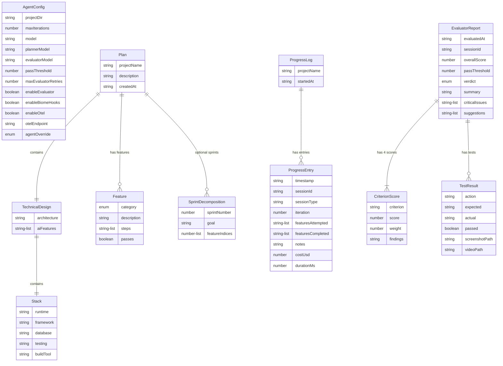

# Zod Schema Library

Complete Zod schema definitions for all structured state flowing between agents in the three-agent system. Every piece of data — feature lists, progress entries, sprint contracts, evaluation reports, agent configuration, and observability logs — is validated at read and write boundaries.

## Schema Relationships



> **Producing agents**: Initializer → `feature_list.json` (Feature[]), Planner → `plan.json` (Plan), Generator → `progress.json` (ProgressLog) + updates Feature.passes, Evaluator → `evaluation_report.json` (EvaluatorReport)

## Feature Definition

```typescript
// schemas.ts
import { z } from "zod";

// Individual feature in feature_list.json
export const FeatureSchema = z.object({
  category: z.enum([
    "functional",    // Core application behavior
    "ui",            // User interface elements
    "api",           // API endpoints
    "integration",   // Third-party integrations
    "performance",   // Performance requirements
    "security",      // Security requirements
    "accessibility", // Accessibility standards
  ]),
  description: z.string().min(10).describe(
    "Human-readable description of what this feature does"
  ),
  steps: z.array(z.string().min(5)).min(1).describe(
    "Ordered steps to verify this feature works. Each step should be a concrete, testable action."
  ),
  passes: z.boolean().default(false).describe(
    "Whether this feature has been verified as working. Only the agent may set this to true after self-verification."
  ),
});

export type Feature = z.infer<typeof FeatureSchema>;

// The complete feature list
export const FeatureListSchema = z.array(FeatureSchema).min(1);
export type FeatureList = z.infer<typeof FeatureListSchema>;
```

**Design choice**: `category` is an enum, not a free-form string. This prevents agents from inventing ad-hoc categories and enables structured filtering in dashboards. The `steps` array requires at least one step with minimum 5 characters to prevent empty or trivially short test descriptions.

## Progress Entry

```typescript
// Structured equivalent of claude-progress.txt
export const ProgressEntrySchema = z.object({
  timestamp: z.iso.datetime().describe("ISO 8601 timestamp"),
  sessionId: z.string().describe("Agent SDK session ID"),
  sessionType: z.enum(["initializer", "planner", "generator", "evaluator"]),
  iteration: z.number().int().positive(),
  featuresAttempted: z.array(z.string()).describe(
    "Feature descriptions attempted this session"
  ),
  featuresCompleted: z.array(z.string()).describe(
    "Feature descriptions marked as passing this session"
  ),
  notes: z.string().describe(
    "Free-form notes about what happened, issues encountered, decisions made"
  ),
  costUsd: z.number().nonnegative().optional(),
  durationMs: z.number().nonnegative().optional(),
});

export type ProgressEntry = z.infer<typeof ProgressEntrySchema>;

export const ProgressLogSchema = z.object({
  projectName: z.string(),
  startedAt: z.iso.datetime(),
  entries: z.array(ProgressEntrySchema),
});

export type ProgressLog = z.infer<typeof ProgressLogSchema>;
```

**Design choice**: Progress is now structured JSON (`progress.json`) instead of the original `claude-progress.txt`. The original blog post noted that JSON is less likely to be inappropriately modified by agents. Structured progress enables dashboard visualizations and programmatic analysis.

## Plan (Planner Output)

```typescript
export const TechnicalDesignSchema = z.object({
  stack: z.object({
    runtime: z.string(),
    framework: z.string(),
    database: z.string().optional(),
    testing: z.string(),
    buildTool: z.string(),
  }),
  architecture: z.string().describe(
    "High-level architecture description — components, data flow, key abstractions"
  ),
  aiFeatures: z.array(z.string()).describe(
    "AI-powered features to incorporate where appropriate"
  ),
});

export const PlanSchema = z.object({
  projectName: z.string(),
  description: z.string().describe("1-3 sentence project summary"),
  createdAt: z.iso.datetime(),
  technicalDesign: TechnicalDesignSchema,
  features: FeatureListSchema,
  sprintDecomposition: z.array(
    z.object({
      sprintNumber: z.number().int().positive(),
      goal: z.string().describe("What this sprint accomplishes"),
      featureIndices: z.array(z.number().int().nonnegative()).describe(
        "Indices into the features array for this sprint"
      ),
    })
  ).optional().describe(
    "Optional sprint decomposition. With Opus 4.6+, the model handles decomposition natively."
  ),
});

export type Plan = z.infer<typeof PlanSchema>;
```

**Design choice**: `sprintDecomposition` is optional. Resource 2 documents that with Opus 4.6, the sprint construct was removed because the model handled decomposition natively. This schema supports both the full sprint system and the simplified single-pass approach.

## Sprint Contract

```typescript
export const SprintContractSchema = z.object({
  sprintNumber: z.number().int().positive(),
  featureScope: z.array(z.string()).describe(
    "Feature descriptions to implement in this sprint"
  ),
  acceptanceCriteria: z.array(
    z.object({
      criterion: z.string(),
      testableBy: z.enum(["browser", "api", "unit", "manual"]),
      description: z.string(),
    })
  ).describe(
    "Specific, testable behaviors that define 'done' for this sprint"
  ),
  negotiatedAt: z.iso.datetime(),
  generatorAcknowledged: z.boolean().default(false),
});

export type SprintContract = z.infer<typeof SprintContractSchema>;
```

## Evaluator Report

```typescript
export const CriterionScoreSchema = z.object({
  criterion: z.enum([
    "design_quality",
    "originality",
    "craft",
    "functionality",
  ]),
  score: z.number().min(0).max(10),
  weight: z.number().min(0).max(1).describe(
    "How heavily this criterion is weighted in the overall score"
  ),
  findings: z.string().describe(
    "Detailed explanation of the score — specific observations, not vague praise"
  ),
});

export const EvaluatorReportSchema = z.object({
  evaluatedAt: z.iso.datetime(),
  sessionId: z.string(),
  sprintNumber: z.number().int().positive().optional(),
  scores: z.array(CriterionScoreSchema).length(4),
  overallScore: z.number().min(0).max(10),
  passThreshold: z.number().min(0).max(10).default(6),
  verdict: z.enum(["pass", "fail"]),
  summary: z.string().describe(
    "2-3 sentence overall assessment"
  ),
  criticalIssues: z.array(z.string()).describe(
    "Issues that must be fixed before passing — concrete, actionable"
  ),
  suggestions: z.array(z.string()).describe(
    "Nice-to-have improvements — not blocking"
  ),
  testsPerformed: z.array(
    z.object({
      action: z.string(),
      expected: z.string(),
      actual: z.string(),
      passed: z.boolean(),
      screenshotPath: z.string().optional().describe(
        "Path to annotated screenshot evidence for this test"
      ),
      videoPath: z.string().optional().describe(
        "Path to video recording of bug reproduction"
      ),
    })
  ),
});

export type EvaluatorReport = z.infer<typeof EvaluatorReportSchema>;
```

**Design choice**: `scores` array is fixed at length 4 (matching the four grading criteria). `findings` is required to be a string (not optional) because the blog post documents that vague praise is a persistent evaluator failure mode — forcing detailed findings mitigates this.

## Agent Configuration

```typescript
export const AgentConfigSchema = z.object({
  projectDir: z.string().min(1),
  maxIterations: z.number().int().nonnegative().default(0).describe(
    "0 = unlimited"
  ),
  model: z.string().default("claude-sonnet-4-6"),
  enableEvaluator: z.boolean().default(true),
  evaluatorModel: z.string().default("claude-opus-4-6").describe(
    "Evaluator should use a capable model for judgment tasks"
  ),
  plannerModel: z.string().default("claude-opus-4-6"),
  passThreshold: z.number().min(0).max(10).default(6),
  maxEvaluatorRetries: z.number().int().nonnegative().default(3),
  enableBiomeHooks: z.boolean().default(true),
  enableOtel: z.boolean().default(true),
  otelEndpoint: z.string().default("http://localhost:4318"),
  agentOverride: z.enum([
    "initializer", "planner", "generator", "evaluator"
  ]).optional().describe(
    "Override: run only this agent type instead of the full orchestrator loop"
  ),
});

export type AgentConfig = z.infer<typeof AgentConfigSchema>;
```

## Session State

```typescript
export const SessionStateSchema = z.object({
  sessionId: z.string(),
  agentType: z.enum(["initializer", "planner", "generator", "evaluator"]),
  iteration: z.number().int().positive(),
  startedAt: z.iso.datetime(),
  completedAt: z.iso.datetime().optional(),
  costUsd: z.number().nonnegative().optional(),
  tokensUsed: z.object({
    input: z.number().int().nonnegative(),
    output: z.number().int().nonnegative(),
    cacheRead: z.number().int().nonnegative(),
    cacheCreation: z.number().int().nonnegative(),
  }).optional(),
  result: z.enum(["success", "error", "max_turns", "interrupted"]).optional(),
});

export type SessionState = z.infer<typeof SessionStateSchema>;
```

## Biome Diagnostic

```typescript
export const BiomeDiagnosticSchema = z.object({
  file: z.string(),
  severity: z.enum(["error", "warning", "info"]),
  category: z.string().describe("e.g., lint/suspicious/noDoubleEquals"),
  message: z.string(),
  line: z.number().int().positive(),
  column: z.number().int().nonnegative(),
  endLine: z.number().int().positive(),
  endColumn: z.number().int().nonnegative(),
  hasFix: z.boolean().describe("Whether Biome can auto-fix this diagnostic"),
});

export type BiomeDiagnostic = z.infer<typeof BiomeDiagnosticSchema>;

export const BiomeReportSchema = z.object({
  timestamp: z.iso.datetime(),
  filesChecked: z.number().int().nonnegative(),
  diagnostics: z.array(BiomeDiagnosticSchema),
  summary: z.object({
    errors: z.number().int().nonnegative(),
    warnings: z.number().int().nonnegative(),
    infos: z.number().int().nonnegative(),
  }),
});

export type BiomeReport = z.infer<typeof BiomeReportSchema>;
```

## OTel Log Entry

```typescript
export const OtelLogEntrySchema = z.object({
  level: z.enum(["info", "warn", "error"]),
  event: z.enum([
    "session_start",
    "session_end",
    "tool_call_start",
    "tool_call_end",
    "tool_call_error",
    "feature_start",
    "feature_completed",
    "feature_fail",
    "evaluation_start",
    "evaluation_verdict",
    "biome_check",
    "biome_fix",
    "biome_commit_gate",
    "compaction",
    "subagent_start",
    "subagent_stop",
    "context_reset",
    "error",
    "cost_update",
  ]),
  agentType: z.enum(["initializer", "planner", "generator", "evaluator"]),
  sessionId: z.string(),
  traceId: z.string().optional(),
  spanId: z.string().optional(),
  attributes: z.record(z.string(), z.union([z.string(), z.number(), z.boolean()])),
  timestamp: z.iso.datetime(),
});

export type OtelLogEntry = z.infer<typeof OtelLogEntrySchema>;
```

---

> **See also**: [Main Reference Architecture](./claude-agent-sdk-reference-architecture.md)
